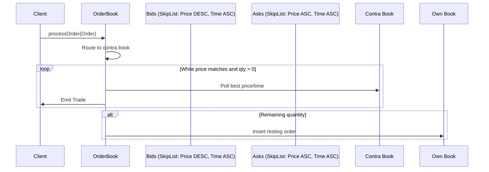

# Architecture: Limit Order Book

## Overview
Ultra-low-latency order matching engine implementing **price-time priority** with lock-free data structures.

## Core Data Structures


## Design Decisions (ADRs)

ADR-001: Fixed-point pricing (micro-dollars)

Decision: All prices stored as long in micro-dollars (cents × 10,000).
Rationale: Eliminates floating-point rounding errors. Critical for settlement accuracy.

ADR-002: ConcurrentSkipListMap for order storage

Decision: Use java.util.concurrent.ConcurrentSkipListMap over custom ring buffers.
Rationale: Lock-free reads during traversal. Provides O(log n) inserts while maintaining sort order for price-time priority.

ADR-003: Immutable Order objects

Decision: All core model objects are immutable. Updates return new instances.
Rationale: Thread safety without synchronization. Aligns with "append-only" ledger philosophy.

Performance Characteristics

* Single-symbol throughput: ~10M orders/sec on 3.2GHz core (see benchmarks).
* Lock-free read path: Matching only blocks on Iterator removal.

```
